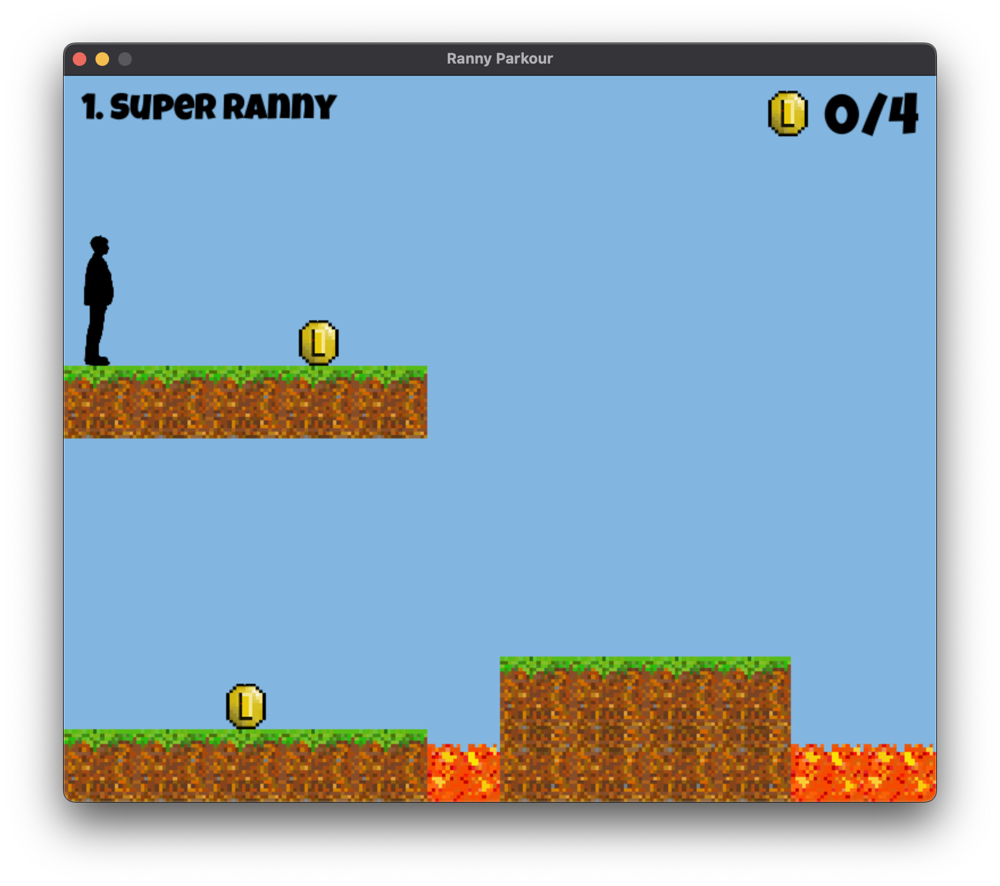

## Ranny Parkour

Made using **pygame**.\
Currently, the game has two levels.



### Gameplay
To navigate, use **WASD** or arrow keys.\
To restart level, press the **n** key.\
To select a level, use number keys **1-9**.

### Releases

Currently, releases are only avaliable for **macOS>=12.3 (Monterey)**\
To install the latest version, go under **releases** and install the **.dmg** file. 

### Building the app 
To build the game for other macOS versions, you must have **python>=3.10**. \
Currently, the build system uses **cx-Freeze**. 

Clone the repo to local machine:
```
git clone https://github.com/lew1101/ranny-parkour.git
```

Then run:
```
cd ranny-parkour
pip3 install -r requirements.txt
sh scripts/build.sh
```

To run without building it into an app, simply run `main.py` as an executable.
```
./main.py
```

To build for different targets, simply modify the `build_targets` array in **scripts/build.sh**. The different build targets can be found in the [cx-Freeze documentation](https://cx-freeze.readthedocs.io/en/latest/setup_script.html).